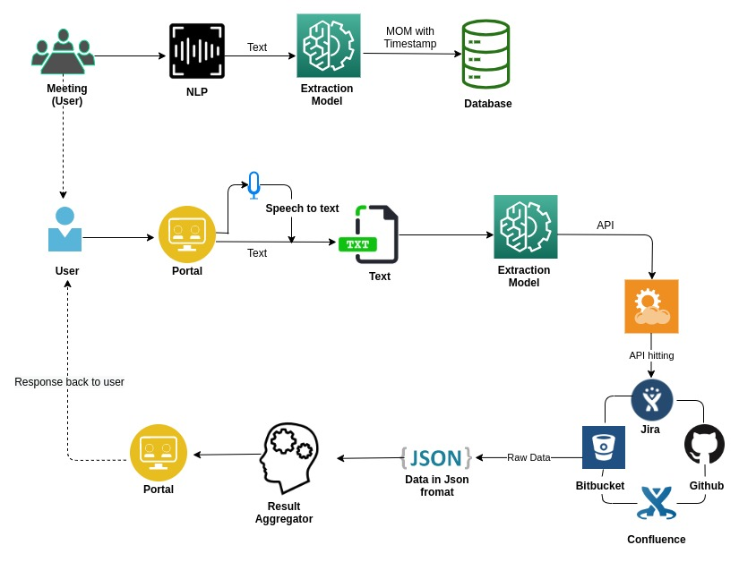

# Welcome to IPM!
Smart AI based application for developers...
## About
IPM is a intelligent **AI-based chat/voice assistant** that provides voice-based access to all major project management platforms such as **Jira, Bitbucket, Confluence and Github**. 

Moreover IPM can record your daily team meetings and provides minutes of meeting, further you can query your MOMs, for various information.
an example can be -> what are the specs of feature XYZ.

So, IPM is your personal **AI**, a tool from the future; for the future.

### Estimation Feature - work in progress
 - We will provide a framework for the teams to perform time and resource allocation on any ticket or feature that a development team is working on
 - We have taken various data from JIRA projects perform deep learning on that to determine, how much time a particular feature takes to complete
 - For instance a feature like authentication has already been implemented earlier in some project in this industry, so on that bases we can predict how much time
 this feature will take , this time will work as a reference to the developer and the Project Manager/Scrum Master/Agile Coach.
 - It will help the client to have a better and rational understanding of a story.
 - It will help the leadership group in managing resources in a project,

### Use Case
- The user can ask queries through chat/voice-to-text conversion and will get appropriate text-to-voice/chat response from IPM.
- IPM will assist the team members and project stakeholders by taking notes of the important discussions and store them in its database for future reference. 
- Can be easily integrated with project management platforms like Jira, Confluence, Bitbucket, Github.
- Creates MOM of scrum ceremonies easily.
- Perform operations on Jira/Github just by a voice command or a chat query.
- Can perform a search on the stored MoMs for various details.

### Architectural diagram

### Workflow

## Features
#### Key Features
- Micro-service architecture 
- Scalable Services 
- No Security Vulnerabilities
- All license handled

### - Github
> - Voice based commands to find details of various repositories of the user .
>- User can find commits, pull requests as well as issues of any repository.
   
### - Jira
>- Issues can be created, updated or deleted through voice commands.
>- Search actions like get comments or ticket description etc.
 
### - Confluence
>- Future Scope

### - Bitbucket
>- Future Scope

### - Minutes OF Meetings
>This module intelligently creates MOM during the team meetings/daily stand-ups for the future reference and querying

## Tech Stack
- Spring boot + Java
- Flask + Python
- Google BERT Service
- Google BART Service
- Unsupervised Machine learning
- Natural Language Processing

## User Interface
- Homepage of IPM

- MoM Capture Page

- Chat bot Page

### Requirements
>-  <a href="https://www.microsoft.com/en-in/windows/get-windows-10"> Windows 10 </a>
or
>- <a href="https://ubuntu.com/#download"> Ubuntu 18.04 </a>
>- macos

## Future Scope
>- Integrating the bot with Google chat like Newi
>- Integrating Confluence,Bitbucket,Gitlab
>- Designing of flutter application that enhances experiences of web application

